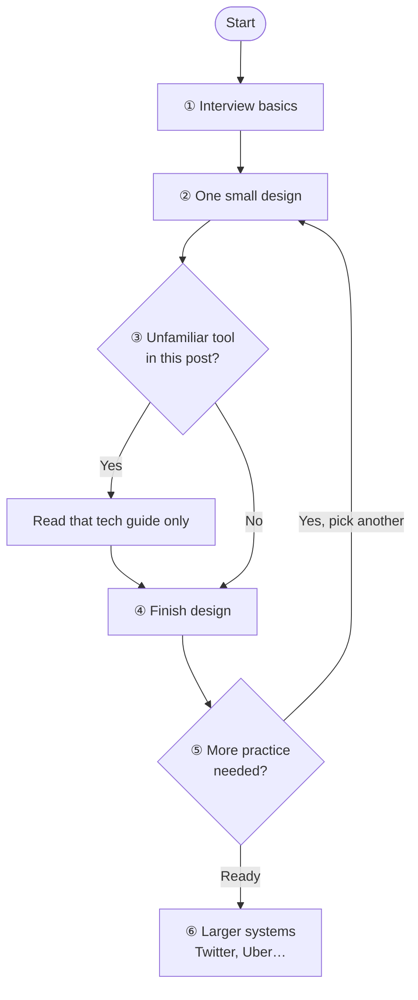

# System Design Interview — Learning Path & Blog Index

This page is the **master index** for [{{ site.title }}]({{ site.url }}{{ site.baseurl }}/): interview learning path, how posts relate to each other, and links to **every** post ({{ site.posts.size }} total).

**Quick links:** [Learning path (detailed)]({{ site.baseurl }}/2025/11/29/system-design-learning-path-index/) · [Technology quick reference]({{ site.baseurl }}/2025/11/29/technology-list-quick-reference/) · [References]({{ site.baseurl }}/2025/11/03/system-design-references/) · [All posts]({{ site.baseurl }}/posts/)

---

## 1. Recommended learning path

Read in order; use technology guides when a design needs a specific component.

### Step 0 — External + blog map

| Resource | Role |
|----------|------|
| [Hello Interview — System Design](https://www.hellointerview.com/learn/system-design) | Framework, patterns, question breakdowns |
| [ByteByteGo — System Design Interview](https://bytebytego.com/courses/system-design-interview) | Visual course, classic problems |
| [System Design References]({{ site.baseurl }}/2025/11/03/system-design-references/) | Books, videos, curated links |
| [Distributed System Design Ecosystem]({{ site.baseurl }}/2026/05/26/distributed-system-design-ecosystem/) | How DB, cache, queue, LB, K8s fit together |
| **This page** | Full catalog + relationships |

### Step 1 — Foundations

1. [Interview Framework]({{ site.baseurl }}/2025/10/04/system-design-interview-framework/)
2. [Interview Guide]({{ site.baseurl }}/2025/11/03/system-design-interview/)
3. [API Gateway connections]({{ site.baseurl }}/2025/10/04/system-design-client-api-gateway-connection-options/)
4. [Cloud overview]({{ site.baseurl }}/2025/10/29/system-design-overview-cloud/) · [Embedded overview]({{ site.baseurl }}/2025/10/29/system-design-overview-embedded/)
5. [CAP Theorem]({{ site.baseurl }}/2025/11/29/cap-theorem-guide/) · [Domain patterns]({{ site.baseurl }}/2025/11/24/common-domain-system-design-patterns/) · [Tech trade-offs]({{ site.baseurl }}/2025/11/17/system-design-technologies-trade-offs/)

### Step 2 — Level 1 (beginner)

- [URL Shortener (full)]({{ site.baseurl }}/2026/05/26/design-url-shortener/) → builds on [short notes]({{ site.baseurl }}/2025/10/29/system-design-url-shortener/)
- [Rate Limiter (full)]({{ site.baseurl }}/2026/05/26/design-rate-limiter/) → builds on [short notes]({{ site.baseurl }}/2025/10/29/system-design-rate-limiter/)
- [Parking Lot]({{ site.baseurl }}/2025/11/24/design-parking-lot-system/) · [Library]({{ site.baseurl }}/2025/11/24/design-library-management-system/) · [Ticket Booking]({{ site.baseurl }}/2025/11/24/design-ticket-booking-system/)
- Local components: [Thread Pool]({{ site.baseurl }}/2025/11/24/design-thread-pool/) · [Connection Pool]({{ site.baseurl }}/2025/11/24/design-connection-pool/) · [Producer-Consumer]({{ site.baseurl }}/2025/11/24/design-producer-consumer-queue/)

### Step 3 — Level 2 (distributed)

- Storage: [Blob/S3]({{ site.baseurl }}/2025/11/09/design-blob-storage-like-s3/) · [KV store]({{ site.baseurl }}/2025/11/14/design-key-value-store-local-horizontal/) · [Redis]({{ site.baseurl }}/2025/11/08/redis-comprehensive-guide/)
- Messaging: [Kafka]({{ site.baseurl }}/2025/11/13/apache-kafka-guide/) · [Pub/Sub]({{ site.baseurl }}/2025/11/29/design-pub-sub-system/) · [Notifications]({{ site.baseurl }}/2025/10/29/system-design-notification-service/)
- Social: [News Feed]({{ site.baseurl }}/2025/11/13/design-news-feed/) · [Instagram]({{ site.baseurl }}/2025/11/13/design-instagram/)
- Crawl/search: [Web Crawler]({{ site.baseurl }}/2025/11/13/design-web-crawler/) → [Distributed crawler]({{ site.baseurl }}/2025/11/14/design-distributed-web-crawler/)

### Step 4 — Level 3 (large scale)

- [Twitter]({{ site.baseurl }}/2025/10/29/system-design-twitter/) · [Social feed (Twitter)]({{ site.baseurl }}/2025/11/20/design-social-media-feed-twitter/)
- [YouTube (short)]({{ site.baseurl }}/2025/10/29/system-design-youtube/) · [YouTube (full)]({{ site.baseurl }}/2025/11/14/design-youtube/)
- [Uber]({{ site.baseurl }}/2025/11/20/design-ride-sharing-service-uber/) · [Job Scheduler]({{ site.baseurl }}/2025/11/03/design-distributed-job-scheduler/) · [ChatGPT/LLM]({{ site.baseurl }}/2025/10/29/system-design-chatgpt/)

**Extended path:** [System Design Learning Path & Technology Index]({{ site.baseurl }}/2025/11/29/system-design-learning-path-index/)

---

## 2. How this blog is organized

**New to system design?** This section explains what kinds of posts exist, what order to read them in, and why some topics appear more than once. You do not need to read every post—use this map to pick the right starting point.

### The big picture (30 seconds)

1. Learn **how to run an interview** (framework, vocabulary, trade-offs).
2. Practice **classic design questions** (URL shortener, chat, news feed, …).
3. Look up **technologies** (Redis, Kafka, databases) only when a design needs them.

External courses ([Hello Interview](https://www.hellointerview.com/learn/system-design), [ByteByteGo](https://bytebytego.com/courses/system-design-interview)) pair well with this blog. Start with [References]({{ site.baseurl }}/2025/11/03/system-design-references/) and [Section 1](#1-recommended-learning-path) above for a week-by-week path.

### Recommended reading order

```text
START
  │
  ├─► ① Map & motivation
  │     • This page (you are here)
  │     • [Interview framework]({{ site.baseurl }}/2025/10/04/system-design-interview-framework/)
  │     • [References]({{ site.baseurl }}/2025/11/03/system-design-references/)
  │
  ├─► ② Core concepts (read before big designs)
  │     • [Interview guide]({{ site.baseurl }}/2025/11/03/system-design-interview/)
  │     • [CAP theorem]({{ site.baseurl }}/2025/11/29/cap-theorem-guide/) · [Common patterns]({{ site.baseurl }}/2025/11/24/common-domain-system-design-patterns/)
  │
  ├─► ③ First designs (beginner-friendly)
  │     • [URL shortener]({{ site.baseurl }}/2026/05/26/design-url-shortener/) · [Rate limiter]({{ site.baseurl }}/2026/05/26/design-rate-limiter/)
  │     • [Parking lot]({{ site.baseurl }}/2025/11/24/design-parking-lot-system/) · [Library system]({{ site.baseurl }}/2025/11/24/design-library-management-system/)
  │
  ├─► ④ Bigger systems (when ③ feels comfortable)
  │     • [News feed]({{ site.baseurl }}/2025/11/13/design-news-feed/) · [Chat]({{ site.baseurl }}/2025/11/14/design-chat-system/) · [Web crawler]({{ site.baseurl }}/2025/11/13/design-web-crawler/)
  │
  ├─► ⑤ Large products (advanced)
  │     • [Twitter]({{ site.baseurl }}/2025/10/29/system-design-twitter/) · [YouTube]({{ site.baseurl }}/2025/11/14/design-youtube/) · [Uber]({{ site.baseurl }}/2025/11/20/design-ride-sharing-service-uber/)
  │
  └─► ⑥ Technology guides (on demand)
        • Open [Technology quick reference]({{ site.baseurl }}/2025/11/29/technology-list-quick-reference/) when you need Redis, Kafka, SQL, etc.
```

### Five types of posts (and when to use each)

Every post on this blog fits **one** of these buckets. Section [3](#3-all-posts-by-category) lists them all.

| Type | What it is | When to read it | Title often looks like |
|------|------------|-----------------|-------------------------|
| **Foundations & interview prep** | How to think, what to say in interviews, book/course links | **First 1–2 weeks** of study | “Interview framework”, “References”, “CAP theorem” |
| **System design problem** | Step-by-step answer to “Design a X” (requirements → API → diagram → scale) | **Main practice** after foundations | “Design a URL Shortener”, “Design a Chat System” |
| **Product-scale design** | Shorter notes on a famous product (Twitter, GitHub, …) | Quick review or second pass on a topic | “System Design: Twitter”, “System Design: YouTube” |
| **Technology guide** | Deep dive on one tool (Redis, Kafka, PostgreSQL, …) | When that tool appears in a design you are studying | “Redis comprehensive guide”, “Apache Kafka guide” |
| **OS / embedded prep** | Interviews focused on OS, JNI, devices, glass, Android native | Only if your role is OS/middleware/embedded | “OS frameworks”, “JNI bridge”, “embedded” |

**Not sure where to click?**

| Your goal | Start here |
|-----------|------------|
| I have never done a system design interview | [Interview framework]({{ site.baseurl }}/2025/10/04/system-design-interview-framework/) → [URL shortener]({{ site.baseurl }}/2026/05/26/design-url-shortener/) |
| I know basics; I want interview practice | [Section 1 — Level 2 & 3](#step-3--level-2-intermediate-distributed-building-blocks) above |
| I keep hearing “use Redis/Kafka” and feel lost | [Technology quick reference]({{ site.baseurl }}/2025/11/29/technology-list-quick-reference/) → pick one guide |
| I want one long curated list | [Learning path index]({{ site.baseurl }}/2025/11/29/system-design-learning-path-index/) |
| I need the full map of components | [Distributed system ecosystem]({{ site.baseurl }}/2026/05/26/distributed-system-design-ecosystem/) |

### Why the same topic sometimes has two posts

This is normal. Use the rule that fits your situation:

**A. Full guide + short notes (read the full one first)**  
The **full** post walks through requirements, APIs, scaling, and trade-offs. The **short** post is a quick recap—good for review right before an interview, not ideal as your first read.

| Topic | Read first (full) | Then review (short) |
|-------|-------------------|---------------------|
| URL shortener | [Full guide]({{ site.baseurl }}/2026/05/26/design-url-shortener/) | [Short notes]({{ site.baseurl }}/2025/10/29/system-design-url-shortener/) |
| Rate limiter | [Full guide]({{ site.baseurl }}/2026/05/26/design-rate-limiter/) | [Short notes]({{ site.baseurl }}/2025/10/29/system-design-rate-limiter/) |

**B. Simple version → harder version (go in order)**  
Start with the simpler problem, then read the scaled-up version.

| Start here | Then read |
|------------|-----------|
| [Web crawler]({{ site.baseurl }}/2025/11/13/design-web-crawler/) | [Distributed web crawler (10k nodes)]({{ site.baseurl }}/2025/11/14/design-distributed-web-crawler/) |
| [Social feed (local)]({{ site.baseurl }}/2025/11/24/design-social-media-feed-local/) | [News feed (distributed)]({{ site.baseurl }}/2025/11/13/design-news-feed/) |

**C. Product overview + focused deep dive (either order is OK)**  
One post covers the whole product; another zooms in on one piece (e.g. feed only).

| Product overview | Focused deep dive |
|------------------|-------------------|
| [System Design: Twitter]({{ site.baseurl }}/2025/10/29/system-design-twitter/) | [Design social media feed (Twitter)]({{ site.baseurl }}/2025/11/20/design-social-media-feed-twitter/) |
| [System Design: YouTube (short)]({{ site.baseurl }}/2025/10/29/system-design-youtube/) | [Design YouTube (full)]({{ site.baseurl }}/2025/11/14/design-youtube/) |

**D. Index page → many linked posts**  
Some posts are **tables of contents**, not lessons themselves.

| Index (start here) | What it links to |
|--------------------|------------------|
| [Technology quick reference]({{ site.baseurl }}/2025/11/29/technology-list-quick-reference/) | All technology guides (Redis, Kafka, databases, …) |
| [Learning path index]({{ site.baseurl }}/2025/11/29/system-design-learning-path-index/) | Level 1–3 design problems in study order |
| **This page** | Learning path + every post by category |

### How designs and technologies connect

You do **not** read every technology guide first. Use this loop while you practice:

| Step | What to do | Example on this blog |
|:----:|------------|----------------------|
| 1 | Learn how to structure an interview answer | [Interview framework]({{ site.baseurl }}/2025/10/04/system-design-interview-framework/) |
| 2 | Pick one **small** design and read it end-to-end | [URL shortener]({{ site.baseurl }}/2026/05/26/design-url-shortener/) |
| 3 | If the post names a tool you do not know, pause and open **only that** guide | “cache” → [Redis]({{ site.baseurl }}/2025/11/08/redis-comprehensive-guide/); “queue” → [Kafka]({{ site.baseurl }}/2025/11/13/apache-kafka-guide/) |
| 4 | Finish the design, then pick the **next** problem (repeat steps 2–3) | [Rate limiter]({{ site.baseurl }}/2026/05/26/design-rate-limiter/) → [News feed]({{ site.baseurl }}/2025/11/13/design-news-feed/) |
| 5 | After several designs, try **larger** systems | [Twitter]({{ site.baseurl }}/2025/10/29/system-design-twitter/) · [Uber]({{ site.baseurl }}/2025/11/20/design-ride-sharing-service-uber/) |
| 6 | Optional: see how pieces fit together | [Distributed system ecosystem]({{ site.baseurl }}/2026/05/26/distributed-system-design-ecosystem/) |

**At a glance (same flow, top to bottom):**

```text
  ┌─────────────────────┐
  │  Interview basics   │  framework, CAP, patterns
  └──────────┬──────────┘
             ▼
  ┌─────────────────────┐
  │  One small design   │  URL shortener, rate limiter, parking lot…
  └──────────┬──────────┘
             ▼
       ┌───────────┐     Yes    ┌──────────────────┐
       │ Unknown   │───────────►│ Technology guide │──┐
       │ tool name?│            │ (Redis, Kafka…)  │  │
       └─────┬─────┘            └──────────────────┘  │
             │ No                                      │
             └──────────────────┬──────────────────────┘
                                ▼
  ┌─────────────────────┐
  │  Next design        │  repeat until comfortable
  └──────────┬──────────┘
             ▼
  ┌─────────────────────┐
  │  Larger systems     │  Twitter, YouTube, Uber…
  └─────────────────────┘
```



**How to read the diagram:** Loop **② → ③ → ④** for each new problem. When **⑤** is “ready,” move to **⑥**—usually after several small/medium designs, not the first week.

### Optional: OS / embedded track

Only needed for OS framework, middleware, or device interviews—not for typical backend “Design Twitter” loops.

1. [OS frameworks guide]({{ site.baseurl }}/2025/11/03/os-frameworks-system-design/)  
2. [7-day prep todo]({{ site.baseurl }}/2025/11/05/os-frameworks-7-day-prep-todo/)  
3. Topic posts (JNI, embedded events, glass, etc.) — listed under **OS, embedded & domain prep** in [Section 3](#3-all-posts-by-category).

---

## 3. All posts by category






### {{ category }}

<ul class="post-index-list">




<li>
  <a href="{{ post.url | relative_url }}">{{ post.title | escape }}</a>
  <span class="post-index-date">({{ post.date | date: "%Y-%m-%d" }})</span>
</li>


</ul>


---

## 4. Complete post catalog

Alphabetical index — **every** post with category and link.

| Post | Category | Date |
|------|----------|------|



| [{{ post.title | escape }}]({{ post.url | relative_url }}) | {{ post_cat | strip }} | {{ post.date | date: "%Y-%m-%d" }} |


---

## Summary

| Metric | Value |
|--------|------:|
| Total posts | {{ site.posts.size }} |
| Categories | 6 |
| Last updated | {{ page.date | date: "%B %d, %Y" }} |

Use the **Learning Path** link in the top navigation to return here anytime.
